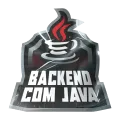

  <h1>Natália S. Gomes</h1>

  
   
  
  
  

<h2></h2>

<table>
  <tr>
    <td width="50%" valign="top">

### About me

<h2></h2>

- I am a Java back-end developer.  
- I work on the development of **RESTful APIs** using **Java** and **Spring Boot**.  
- I create solutions focused on generating a positive impact on people's lives.  
- I apply my creativity to solve problems in a practical and efficient way.  
- I use tools like Docker, JUnit, and Swagger in my daily work.  
- Currently working on **microservices communication**, **RabbitMq** & **Kafka**.  

<h2></h2>

### Work Experience
<h2></h2>

**Java Backend Developer | Freelancer**  
_Jun. 2022 – present_

- Development of RESTful APIs with **Java 17** and **Spring Boot**, from requirements gathering to deployment.
- Implementation of authentication via **JWT** and **OAuth2 Resource Server**.
- Optimization of Docker images with **multi-stage builds**, reducing their size by 50%.
- Test coverage above 80% with **JUnit** and **Mockito**.
- Integrations with **PostgreSQL, MySQL, MongoDB**, and external services.
- Asynchronous communication with **RabbitMQ** and **SQS** in microservices.
- API documentation with **Swagger/OpenAPI**.

    </td>
    <td width="50%" valign="top">

### Education

<h2></h2>

**Tecnologia em Sistemas para Internet**  
IFPB – Instituto Federal da Paraíba  
_Fev. 2021 – Mar. 2025_

<h2></h2>

### Languages

<h2></h2>

- **English – B2:** fluent technical reading, intermediate written communication, practice in documentation, tutorials and international courses.
- **Spanish – B1:** basic reading and general understanding.

<h2></h2>

### Skills

<h2></h2>

<h2></h2>

### Certifications

<h2></h2>

- **Back-End Developer** – Oracle Next Education  
- **Arquitetura com Spring Boot e Cloud** – DIO  
- **Java e Spring Framework** – Alura  

    </td>
  </tr>
</table>

<h2></h2>

  <h2>Portfolio</h2>

<!-- img src: https://br.freepik.com/psd-gratuitas/fundo-3d-com-venda-de-elementos-medicos_66244398.htm#fromView=image_search_similar&page=1&position=27&uuid=46612d85-6d5e-4a26-a666-446c4f6715df&query=3d+health+app  -->

**MAVIS** - RESTful API for managing health profiles and send emergency alerts. Currently being refactored to separate responsibilities into microservices.  
**Technologies:** `Java`, `Spring Boot`, `JWT`, `OAuth2 RS`, `Flyway`, `Hibernate`, `Swagger`, `PostgreSQL`, `Docker`  
**Links:** [Repository](https://github.com/nataliatsi/mavis-backend)

<h2></h2>

<!-- img src: https://br.freepik.com/psd-gratuitas/renderizacao-3d-do-icone-de-bitcoin-do-grafico_25778906.htm  -->

**Spendwise API** - Backend for managing personal expenses, with dynamic filters, JWT authentication, income and expense management, budgeting by category, and financial reports generation.  
**Technologies:** `Java`, `Spring Boot`, `JWT`, `OAuth2 RS`, `PostgreSQL`, `Hibernate`, `JUnit`, `Swagger`, `H2`
**Links:** [Repository](https://github.com/nataliatsi/api-despesas-java-05/tree/natalia)

<h2></h2>

<!-- img src: https://br.freepik.com/psd-gratuitas/renderizacao-3d-do-valor-do-icone-bitcoin_25778954.htm -->

**CurrencyMate** - A console-based currency conversion tool using real-time exchange rates from ExchangeRate-API. Stores conversion history in JSON and logs key events.  
**Technologies:** `Java`, `REST API Consumption`, `JSON`  
**Links:** [Repository](https://github.com/nataliatsi/conversor-de-moeda)

<h2></h2>

<!-- img src: https://br.freepik.com/psd-gratuitas/renderizacao-3d-do-fundo-do-mecanismo-de-pesquisa_49652304.htm#fromView=image_search_similar&page=1&position=4&uuid=d83702d4-8443-47c4-9ce4-7cd13525c1bd&query=3d+search+app -->

**SolrBridge** - Microservice architecture for indexing and querying CSV data using Solr. Includes a Flask API to ingest data into PostgreSQL, organize it into JSON and index via Solr. Dockerized for ease of deployment.  
**Technologies:** `Python`, `Flask`, `PostgreSQL`, `Solr`, `Docker`  
**Links:** [Repository](https://github.com/nataliatsi/solr-with-flask-api)

<h2></h2>

